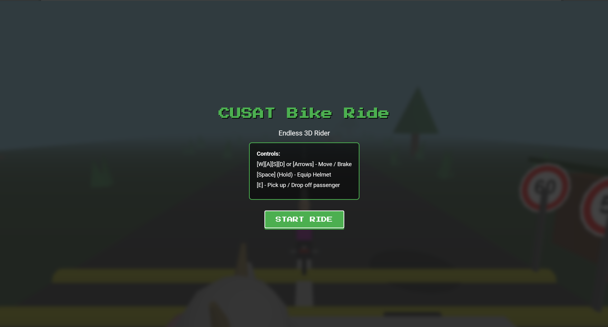
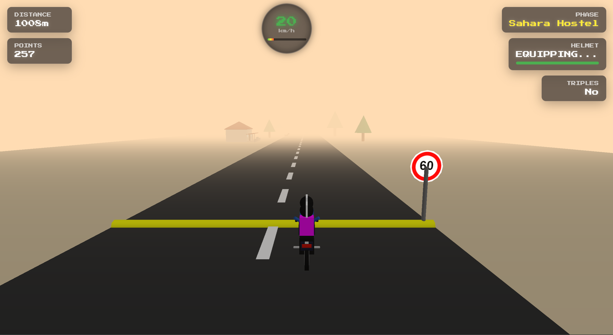
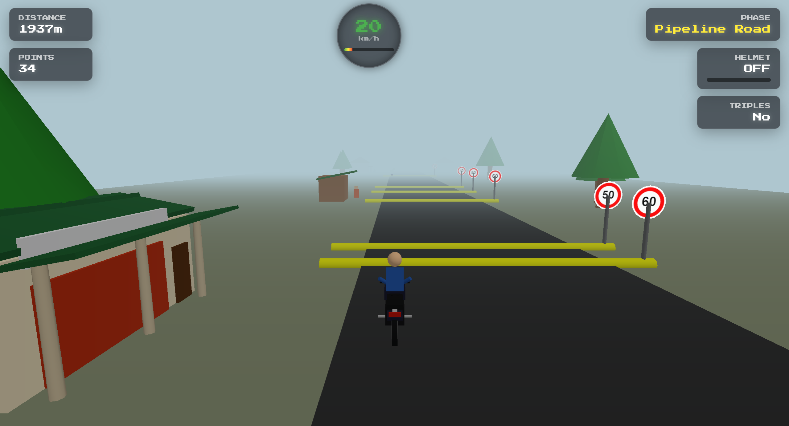
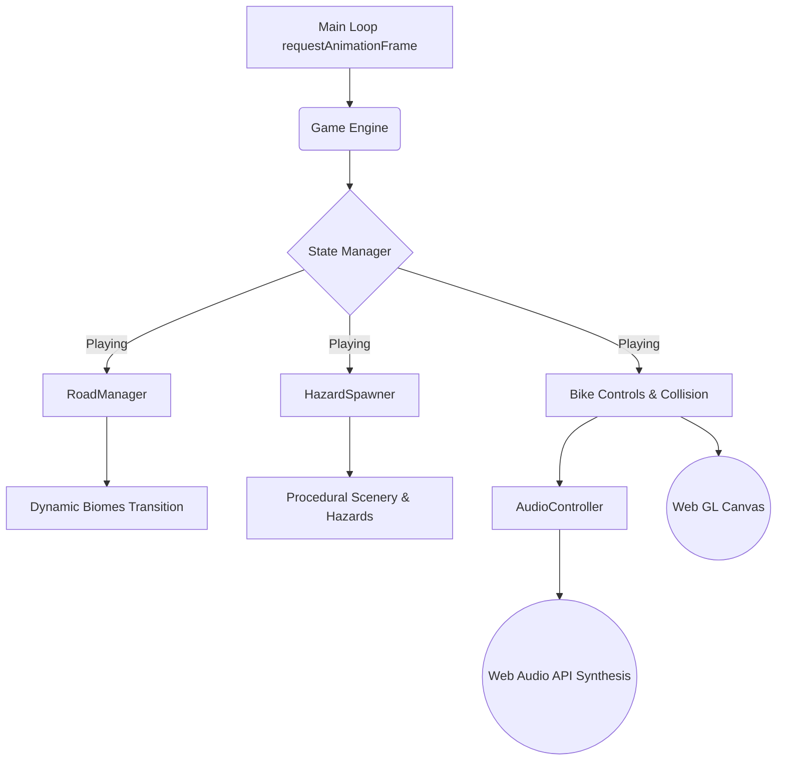

# CUSAT Ride 🎯


## Basic Details
### Team Name: Donut

### Team Members
- Team Lead: Hafiz Hussain - CUSAT
- Member 2: Kevin B Kothat - CUSAT

### Project Description
CUSAT Ride is an endless 3D survival riding game where you navigate through the CUSAT campus biomes, dodging stray animals, violently swerving around potholes, equipping helmets, and picking up illegal 'triples' passengers to survive the MVD.

### The Problem (that doesn't exist)
Students safely and peacefully getting to class on time without breaking any traffic rules or doing triples on a bike.

### The Solution (that nobody asked for)
We built a highly realistic, physics-driven simulation of the CUSAT campus commute where the only way to survive is to equip your helmet, pick up illegal triples passengers to use as human shields against speedbumps, and violently swerve around cows and stray dogs to outrun the Motor Vehicles Department (MVD).

## Technical Details
### Technologies/Components Used
For Software:
- Languages used: JavaScript (ES6), HTML5, CSS3
- Frameworks used: None (Vanilla JS)
- Libraries used: Three.js (for 3D rendering)
- Tools used: Web Audio API (Procedural sound synthesis)

### Implementation
For Software:
# Installation
```bash
npm install -g http-server
```

# Run
```bash
npx http-server -p 8080
```
Then navigate to http://localhost:8080 in your web browser.

### Project Documentation
For Software:

# Screenshots (Add at least 3)

*The Main Menu showing the controls and retro arcade vibe before starting the ride.*


*Equipping the helmet while navigating the hazy, sandy Sahara Hostel phase.*


*Dodging a gauntlet of speedbumps and speed limit signs on Pipeline Road near a local Chayakada.*

# Diagrams
*Architecture of CusatRide*



### Project Demo
# Video
[CusatRide Demo Gameplay](https://drive.google.com/file/d/15yI3or-18AkvotLd_wAdhDbmzgIG0CkQ/view?usp=sharing)
*Gameplay recording demonstrating the Triples mechanic and MVD avoidance.*

# Additional Demos
None yet!

## Team Contributions
- Hafiz Hussain: Core Game Engine Architecture, 3D Rendering (Three.js), Physics & Collision Systems, and Web Audio Synthesis.
- Kevin B Kothat: Procedural Hazard Generation, Dynamic Biome Transitions, UI Integration, and the Triples/Helmet mechanics.

---
Made with ❤️ at TinkerHub Useless Projects 


